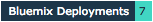

[](https://travis-ci.org/IBM-Bluemix/cf-deployment-tracker-client-swift)
[![Swift][swift-badge]][swift-url]
[![Platform][platform-badge]][platform-url]

# Overview
The cf deployment tracker for Swift is a package used to track number of deployments to Bluemix for a particular Swift project. This Swift package requires little setup and allows IBMers to view deployment stats on the [Deployment Tracker](https://deployment-tracker.mybluemix.net/stats), for their demo/tutorial projects. If you'd like, you can include a deployment count badge in your project's README:



## Swift version
- The 0.1.x releases were tested on macOS and Linux using the Swift `DEVELOPMENT-SNAPSHOT-2016-07-25-a` binaries.
- The 0.3.x and 0.4.x releases were tested on macOS and Linux using the Swift `3.0` binaries.
- The 0.5.x releases were tested on macOS and Linux using the Swift `3.0.1` binaries.

You can download different versions of the Swift binaries by following this [link](https://swift.org/download/).

## To Use
1. To leverage the cf-deployment-tracker-client-swift package in your Swift application, you should specify a dependency for it in your `Package.swift` file:

	```swift
	 import PackageDescription

	 let package = Package(
	     name: "MyAwesomeSwiftProject",

	     ...

	     dependencies: [
	         .Package(url: "https://github.com/IBM-Bluemix/cf-deployment-tracker-client-swift.git", majorVersion: 0, minor: 5),

	         ...

	     ])
	```
2. Once the Package.swift file of your application has been updated accordingly, you can import the `CloudFoundryDeploymentTracker` module in your code. Additionally, you will need to initialize the CloudFoundryDeploymentTracker and call the `track()` method, as seen here:

	```
	import CloudFoundryDeploymentTracker

	...

	CloudFoundryDeploymentTracker(repositoryURL: "https://github.com/IBM-Swift/Kitura-Starter-Bluemix.git", codeVersion: nil).track()

	```
The above code should be used within the main entry point of your Swift application, generally before you start your server.

3. Lastly, you should add a copy of the [Privacy Notice](#privacy-notice) to the README of your project. All applications that use the deployment tracker must have a Privacy Notice.

## Example App
To see how to include this package into your app, please visit [Kitura-Starter](https://github.com/IBM-Bluemix/Kitura-Starter). View the [Package.swift](https://github.com/IBM-Bluemix/Kitura-Starter/Package.swift#L31) and [main.swift](https://github.com/IBM-Bluemix/Kitura-Starter/Sources/main.swift#L30) as a reference.

## Privacy Notice
```
## Privacy Notice
This Swift application includes code to track deployments to [IBM Bluemix](https://www.bluemix.net/) and other Cloud Foundry platforms. The following information is sent to a [Deployment Tracker](https://github.com/IBM-Bluemix/cf-deployment-tracker-service) service on each deployment:

* Swift project code version (if provided)
* Swift project repository URL
* Application Name (`application_name`)
* Space ID (`space_id`)
* Application Version (`application_version`)
* Application URIs (`application_uris`)
* Labels of bound services
* Number of instances for each bound service and associated plan information

This data is collected from the parameters of the `CloudFoundryDeploymentTracker`, the `VCAP_APPLICATION` and `VCAP_SERVICES` environment variables in IBM Bluemix and other Cloud Foundry platforms. This data is used by IBM to track metrics around deployments of sample applications to IBM Bluemix to measure the usefulness of our examples, so that we can continuously improve the content we offer to you. Only deployments of sample applications that include code to ping the Deployment Tracker service will be tracked.

### Disabling Deployment Tracking
Please see the README for the sample application (i.e. [Kitura-Starter](https://github.com/IBM-Bluemix/Kitura-Starter)) that includes this package for instructions on disabling deployment tracking, as the instructions may vary based on the sample application in which this package is included.
```

## License
This Swift package is licensed under Apache 2.0. Full license text is available in [LICENSE](LICENSE).

[swift-badge]: https://img.shields.io/badge/Swift-3.0-orange.svg
[swift-url]: https://swift.org
[platform-badge]: https://img.shields.io/badge/Platforms-OS%20X%20--%20Linux-lightgray.svg
[platform-url]: https://swift.org
